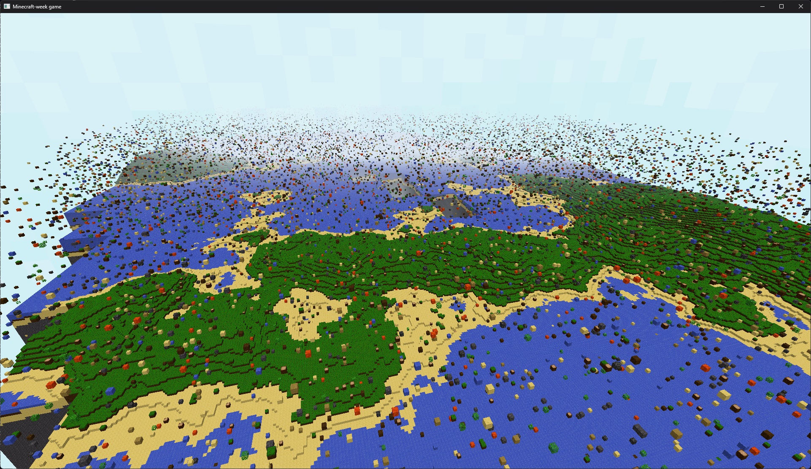

# minecraft-week
Minecraft inspired voxel game made in one week with Rust and wgpu
### Current state

### Goals
- Infinite world generation
- Player collision
- World interaction
- Async chunk generation
- Sun shadows
- Voxel lighting

#### Notes

##### Files that are in disarray
- mesher.rs
  - it works, but the chunks have responsibility of meshing themselves in a little tangled way
- chunk.rs
- main file

##### Logic that needs changed
- chunk meshing is so slow

##### Blocks to add
- ores (coal, iron etc.)
- flower

###### Goals for today
- load chunks with a background thread
- make terrain generation look nice

