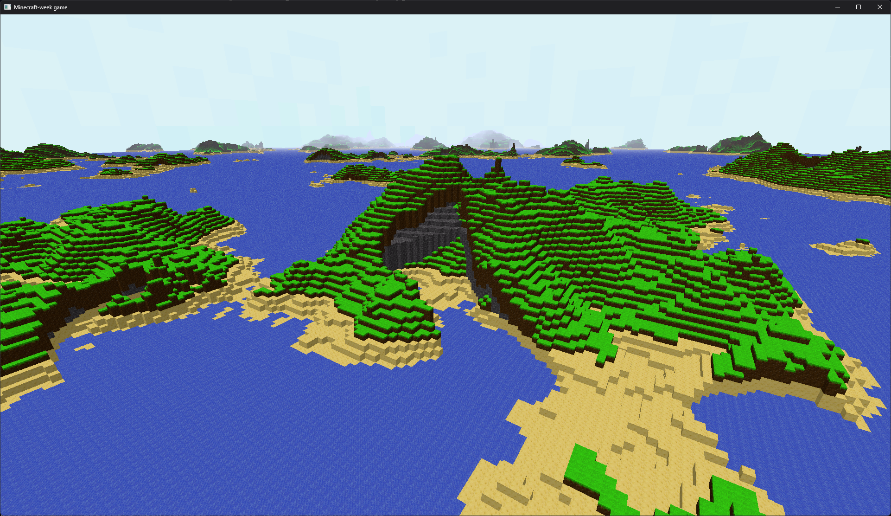
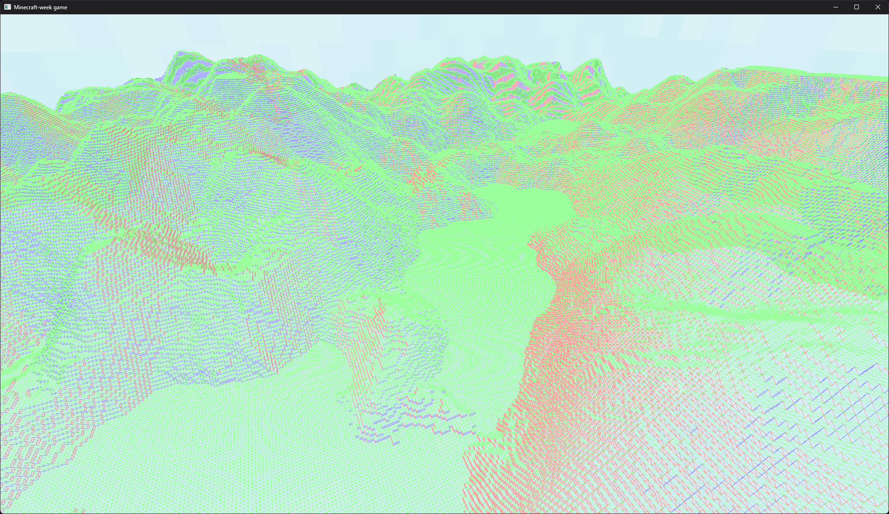

# minecraft-week
Minecraft inspired voxel game made in one week with Rust and wgpu
### Current state

### Goals
- Infinite world generation
- Player collision
- World interaction
- Async chunk generation
- Sun shadows
- Voxel lighting

#### Notes

##### Files that are in disarray
- chunk.rs
- terrain.rs
- main file

##### Blocks to add
- ores (coal, iron etc.)
- flower

###### Goals for today
- make terrain generation look nice
  - this is the last thing that needs to be done, basically
- add a screenshot tool
- chunk clearing currently leaks GPU memory - this needs to be fixed
  - meshes are so cheap tho, that at this point it doesn't really matter

