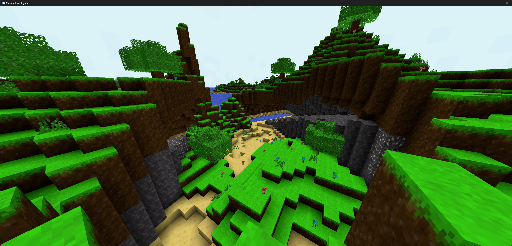

# minecraft-week

Minecraft inspired voxel game made in one week with Rust and wgpu

### Building

You will need:
- Rust v1.9 or later
- Cargo-nightly toolchain (unlikely to build w/o)

Run the project:
`$ cargo +nightly run --release -- <seed>`

Seed optional:
`$ cargo +nightly run --release`

### Goals

- Infinite procedural generation
- Player-world interaction
- Asynchronous chunk forming & meshing
- Sun shadows
- Voxel lighting & ambient occlusion
- Physics and collision detection

#### Were they achieved?

Sun shadows weren't able to be added in the initial week

Terrain generation was brought to a satisfactory point (visually) but the module
responsible for generating terrain is a mess and not scalable for biomes, which
was a goal

### Resources

- https://sotrh.github.io/learn-wgpu/
- https://playspacefarer.com/voxel-meshing/
- https://github.com/jdah/minecraft-again.git
- https://0fps.net/2013/07/03/ambient-occlusion-for-minecraft-like-worlds/
- Reinventing Minecraft world generation by Henrik Kniberg

### Examples

There are some photos in `images/` that I took while making this.

### License

Use any part for whatever you want.

