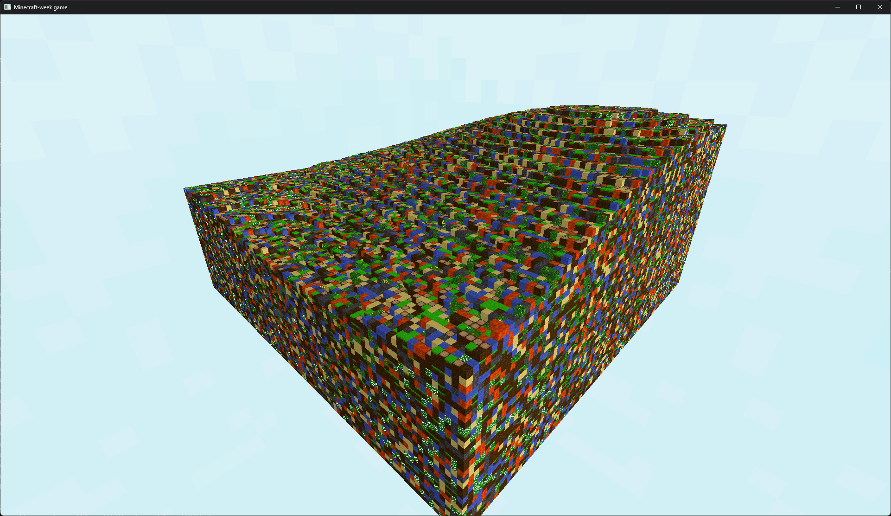

# minecraft-week
Minecraft inspired voxel game made in one week with Rust and wgpu

### Current state

### Goals
- Infinite world generation
- Player collision
- World interaction
- Async chunk generation
- Sun shadows
- Voxel lighting

#### Notes

##### Files that are in disarray
- mesher.rs
- chunk.rs
- main file

##### Blocks to add
- gravel
- ores (coal, iron etc.)
- wood planks
- flower

###### Goals for today
- terrain generation (look nice)
- infinite generation

