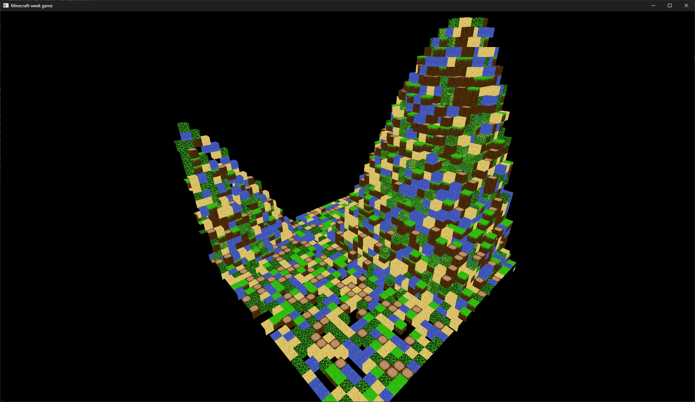

# minecraft-week
Minecraft inspired voxel game made in one week with Rust and wgpu

### Current state

### Goals
- Infinite world generation
- Player collision
- World interaction
- Async chunk generation
- Sun shadows
- Voxel lighting

#### Notes

##### Files that are in disarray
- mesher.rs
- block.rs
- chunk.rs

##### Blocks to add
- dirt
- lava
- gravel
- stone
- ores (coal, iron etc.)
- wood planks
- flower

