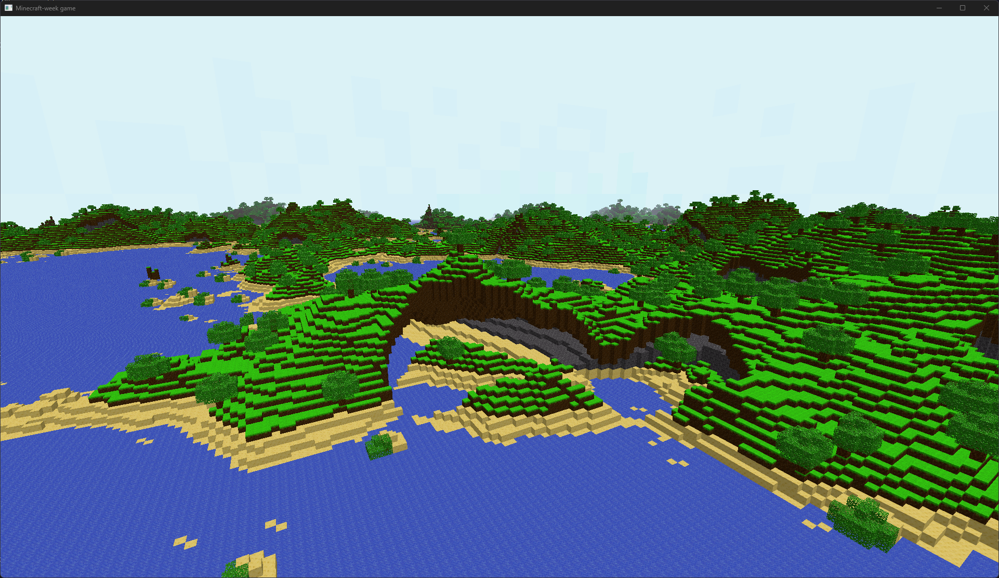

# minecraft-week
Minecraft inspired voxel game made in one week with Rust and wgpu

### Current state

### Goals
- Infinite world generation
- Player collision
- World interaction
- Async chunk generation
- Sun shadows
- Voxel lighting

#### Notes

##### Files that are in disarray
- terrain.rs
- minecraft_week.rs - the main file is so bad

##### Blocks to add
- ores (coal, iron etc.)

###### Goals for today
- add a screenshot tool
- add voxel AO
- fix structures generating over chunk borders
- refactor terrain so that the file is readable

